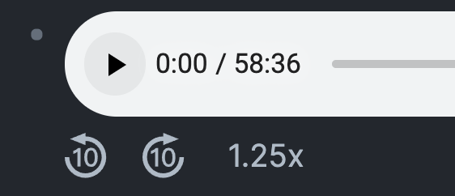

# logseq-media-controls

Video and audio controls made for [Logseq](https://logseq.com)



### Features
- 🏎 Playback speed control
- 🎮 Skip forward / backward

## Usage

Type `/` and then `Insert media controls`

or past the following snippet

```
{{renderer :media_controls}}
```

## Example

```


{{renderer :media_controls}}
```

## Install

1. Open the Logseq app
2. Navigate to the plugins page or use the shortcut <kbd>t</kbd>+<kbd>p</kbd>
3. Switch to the Marketplace tab
4. Search for `media controls`

## Known limitation

- Does not work with YouTube or any other video embeded using `iframes`
